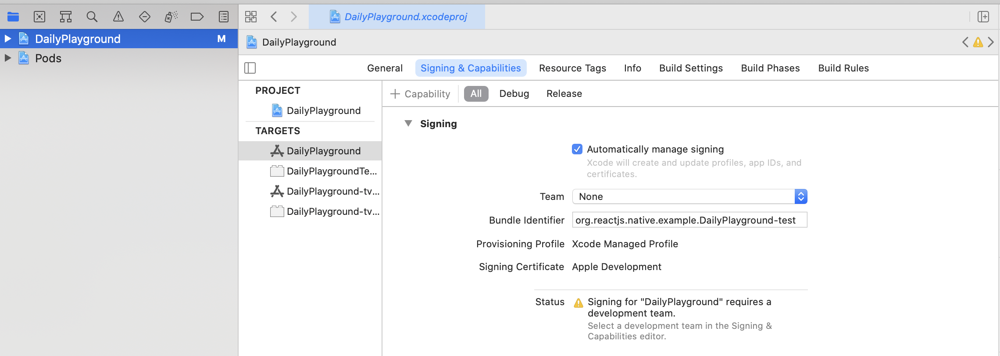

# react-native-daily-js-playground

A simple app showcasing `react-native-daily-js`, the [Daily](https://www.daily.co) library for React Native.

## Usage

### General React Native setup

In [the React Native development environment setup page](https://reactnative.dev/docs/environment-setup), select "React Native CLI Quickstart" and follow the instructions under the heading "Installing dependencies".

The instructions vary depending on your development OS (macOS, Windows, Linux) and target OS (iOS, Android), so be sure to follow the steps for each closely.

**Note:** You will need Xcode (i.e. a Mac) for iOS development.

### Building

```bash
cd DailyPlayground

# Use the version of node specified in .nvmrc
nvm i

# Unfortunate one-time thing, necessary for building from Xcode: make this node
# version the default, so build phases use the right version
nvm alias default $(node --version)

npm i

# Generate ios/DailyPlayground.xcworkspace
# IMPORTANT: make sure you have the right version of Cocoapods installed for this project. See Podfile.lock for version.
npx pod-install
```

### Running the React Native dev server

```bash
cd DailyPlayground

# Bundle JS, start JS file server, and start watching for file changes in order
# to re-bundle
npm start -- --reset-cache
```

Leave this terminal tab open and running.

### Running on iOS

First, you'll need to do a one-time setup. This is required to build to device.

If you're familiar with Xcode, you'll need to open `DailyPlayground.xcworkspace` and, in the DailyPlayground target settings, provide a development team registered with Apple.

If you're newer to Xcode, here are some more detailed instructions to get you started.

First, open the project in Xcode. Make sure to specifically select `DailyPlayground.xcworkspace` from `/DailyPlayground/ios`. This is also a good time to plug in your device to be sure the following steps are successful.

From the main menu, select `Preferences` and then `Accounts`. Click the `+` sign to add an account (e.g. an Apple ID).

Once an is account added, close `Preferences` and select the folder icon in the top left corner. Then select `DailyPlayground` from the side panel and navigate to `Signing & Capabilities` in the top nav bar. Open the "Team" dropdown and select the account added in the previous step. The "Signing Certificate" section should update accordingly with your account information.



Once your settings have been updated, select your device from the device dropdown. Simply hit Run (or the Play icon) and you're ready to go!

**Note:** The app should work as long as you're on the same WiFi as your dev box running the React Native development server.

**iOS debugging tips:**

- If you see the error `Change your bundle identifier to a unique string to try again` update the "Bundle Identifier" input in `Signing & Capabilities` to make it unique. This should clear the error.

- If you see an error that says `Xcode was unable to launch because it has an invalid code signature, inadequate entitlements or its profile has not been explicitly trusted by the user` you may need to update the settings on your iPhone device to enable the required permissions. Open `Settings` on your iPhone, select `General`, then `Device Management`, and click `Trust` for DailyPlayground.

- You may also be prompted to enter you login keychain password. Be sure to click `Always trust` to avoid the prompt showing multiple times.

### Running on Android

After plugging in an Android device [configured for debugging](https://developer.android.com/studio/debug/dev-options), simply run:

```
npm run android
```

---

### Room configuration

To keep things simple, a one-time, temporary Daily room is used. To use one of your own rooms, update the object returned in `/DailyPlayground/api.ts`.

```js
async function createRoom(): Promise<{ url: string }> {
  let response = await fetch(newRoomEndpoint),
    room = await response.json();
  return room;

  // Comment out the above and uncomment the below, using your own URL
  // return { url: "https://your-domain.daily.co/hello" };
}
```

As a reminder, you can create and configure rooms through your [Daily dashboard](https://dashboard.daily.co/rooms) or through calls to the [Daily REST API](https://docs.daily.co/reference#rooms).

---

### Interactive debugging

Ever since the [introduction of synchronous methods](https://github.com/react-native-webrtc/react-native-webrtc/commit/1fbe7e14bf540e1651c98ee11fc11f690f61f622) to `react-native-webrtc`, the common approach of using the [Chrome dev tools for interactive debugging](https://reactnative.dev/docs/debugging#chrome-developer-tools) sadly will not work.

Fear not! You can still do interactive debugging. How to do so will depend on the device you're debugging on as well as whether or not you're using the [Hermes JavaScript engine](https://reactnative.dev/docs/hermes):

- On Android, you _must_ [enable Hermes](https://reactnative.dev/docs/hermes#android) to debug interactively. Once you've done so, you'll be able to debug using the [Chrome inspector](https://reactnative.dev/docs/hermes#debugging-js-on-hermes-using-google-chromes-devtools).

- On iOS, you can debug with or without Hermes. If you're not using Hermes, you can debug using the [Safari dev tools](https://reactnative.dev/docs/debugging#safari-developer-tools). If you are [using Hermes](https://reactnative.dev/docs/hermes#ios), you can debug using the [Chrome inspector](https://reactnative.dev/docs/hermes#debugging-js-on-hermes-using-google-chromes-devtools).

To give yourself access to helpful globals from the console, uncomment the following block in `App.tsx`:

```ts
/**
 * Uncomment to set up debugging globals.
 */
useEffect(() => {
  const g = global as any;
  g.Daily = Daily;
  g.callObject = callObject;
}, [callObject]);
```

### React Native Debugger

If you're looking to inspect specific components, update styles, or inspect network calls, [React Native Debugger](https://github.com/jhen0409/react-native-debugger) can also be helpful for debugging.
