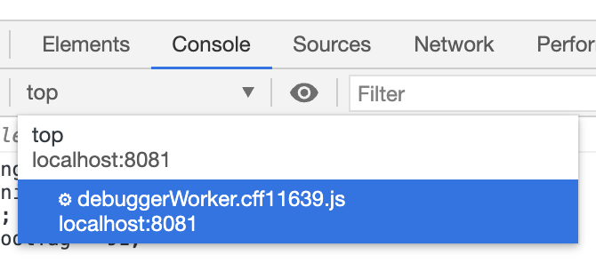

# rn-daily-js-playground

A simple app showcasing `react-native-daily-js`, the [Daily.co](https://www.daily.co) library for React Native.

## Usage

### General React Native setup

In [the React Native development environment setup page](https://reactnative.dev/docs/environment-setup), select "React Native CLI Quickstart" and follow the instructions under the heading "Installing dependencies".

The instructions vary depending on your development OS (macOS, Windows, Linux) and target OS (iOS, Android), so be sure to follow the steps for each closely.

**Note:** You will need Xcode (i.e. a Mac) for iOS development. 

### Building

```bash
cd DailyPlayground

# Use the version of node specified in .nvmrc
nvm i

npm i

# Generate ios/DailyPlayground.xcworkspace
npx pod-install

OR

cd /ios
pod install
```

### Running the React Native dev server

```bash
cd DailyPlayground

# Bundle JS, start JS file server, and start watching for file changes in order
# to re-bundle
npm start -- --reset-cache
```

Leave this terminal tab open and running.

### Running on iOS

First, you'll need to do a one-time setup. This is required to build to device.

If you're familiar with Xcode, you'll need to open `DailyPlayground.xcworkspace` and, in the DailyPlayground target settings, provide a development team registered with Apple. 

If you're newer to Xcode, here are some more detailed instructions to get you started.

First, open the project in Xcode. Make sure to specifically select `DailyPlayground.xcworkspace` from `/DailyPlayground/ios`. This is also a good time to plug in your device to be sure the following steps are successful.
 
From the main menu, select `Preferences` and then `Accounts`. Click the `+` sign to add an account (e.g. an Apple ID).

Once an is account added, close `Preferences` and select the folder icon in the top left corner. Then select `DailyPlayground` from the side panel and navigate to `Signing & Capabilities` in the top nav bar. Open the "Team" dropdown and select the account added in the previous step. The "Signing Certificate" section should update accordingly with your account information.


Once your settings have been updated, select your device from the device dropdown. Simply hit Run (or the Play icon) and you're ready to go!

**Note:** The app should work as long as you're on the same WiFi as your dev box running the React Native development server.

**iOS Debugging Tips**

If you see the error `Change your bundle identifier to a unique string to try again.` update the "Bundle Identifier" input to make it unique. This should clear the error.

If you see an error that says `Xcode was unable to launch because it has an invalid code signature, inadequate entitlements or its profile has not been explicitly trusted by the user` you may need to update the settings on your iPhone device to enable the required permissions. Open `Settings` on your iPhone, select `General`, then `Device Management`, and click `Trust` for DailyPlayground.

You may also be prompted to enter you login keychain password. Be sure to click `Always trust` to avoid the prompt showing multiple times.

### Running on Android

After plugging in an Android device [configured for debugging](https://developer.android.com/studio/debug/dev-options), simply run:

```
npm run android
```

----

### Room Configuration

To keep things simple, a pre-existing demo Daily.co room is used. If you would like to use one of your own rooms, update the object returned in `/DailyPlayground/api.ts`.

```js
async function createRoom(): Promise<{ url: string }> {
  let response = await fetch(newRoomEndpoint),
    room = await response.json();
  return room;

  // Comment out the above and uncomment the below, using your own URL
  // return { url: "https://your-domain.daily.co/hello" };
}
```

**Note:**
Your Daily.co room must be configured in a particular way in order for a `react-native-daily-js` client to be able to connect to it: it must specify the property `signaling_impl: ws`.

To create a room with the `signaling_impl` property set appropriately, run the following (replacing <your-api-key> with your actual API key):

```
curl --request POST \
  --url https://api.daily.co/v1/rooms \
  --header 'authorization: Bearer <your-api-key>' \
  --header 'content-type: application/json' \
  --data '{"properties":{"signaling_impl":"ws"}}'
```

Of course, you may also want to specify a name as well as other properties. See the [Daily.co REST API docs](https://docs.daily.co/reference#rooms) for general guidance on how to create a new room or update an existing room.

----
### Console debugging

Shake your device while it's running the app. A debugging menu will pop up. Select "Debug". This will automatically open a Chrome tab. Open Chrome dev tools. In the Console tab of Chrome dev tools, click the dropdown that says "top" and select "debuggerWorker" from the list.



Now you should be all set to use Chrome dev tools to view logged messages and run commands like you would on a website! (NOTE: you may have to reload the JavaScript a couple of times for the debugger to properly connect).

To give yourself access to helpful globals from the console, uncomment the following block in `App.tsx`:

```ts
/**
 * Uncomment to set up debugging globals.
 */
useEffect(() => {
  const g = global as any;
  g.Daily = Daily;
  g.callObject = callObject;
}, [callObject]);
```

### React Native Debugger

If you're looking to inspect specific components, update styles, or inspect network calls, you may also find [React Native Debugger](https://github.com/jhen0409/react-native-debugger) helpful for debugging.
